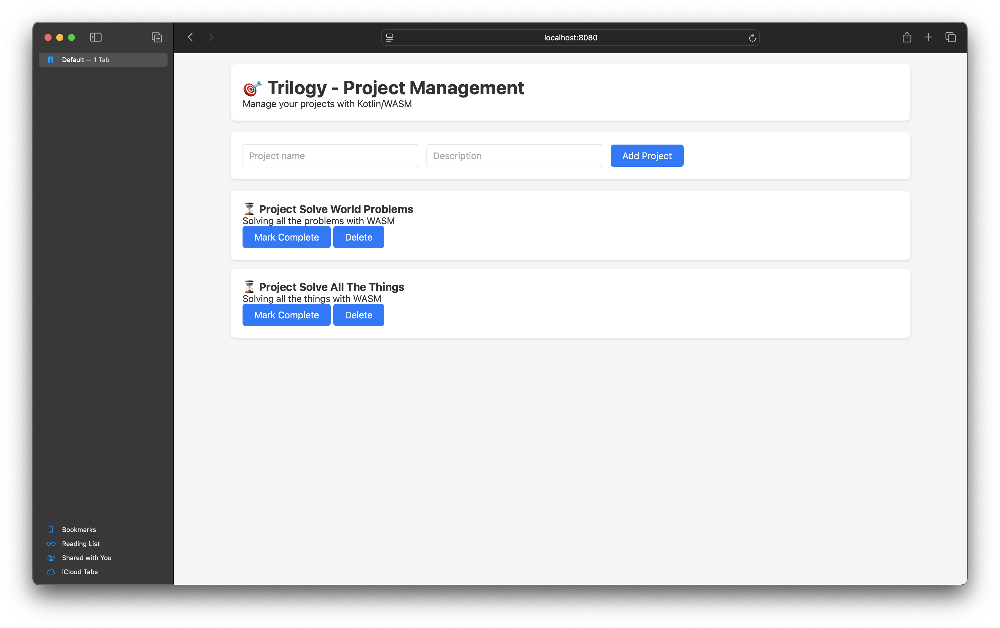

# Trilogy


A fullstack project management application built with Kotlin/WASM.

## Screenshot



## Features

- Create and manage projects
- Mark projects as complete/incomplete
- Delete projects
- Built entirely with Kotlin, compiled to WebAssembly

## Getting Started

### Prerequisites
- JDK 17 or higher
- Gradle 8.0+

### Scaffolding the App

```
chmod +x setup-trilogy.sh
./setup-trilogy.sh
```

### Running the App
Run in development environment as follows -
```bash
cd trilogy
./gradlew clean
./gradlew wasmJsBrowserDevelopmentRun
```